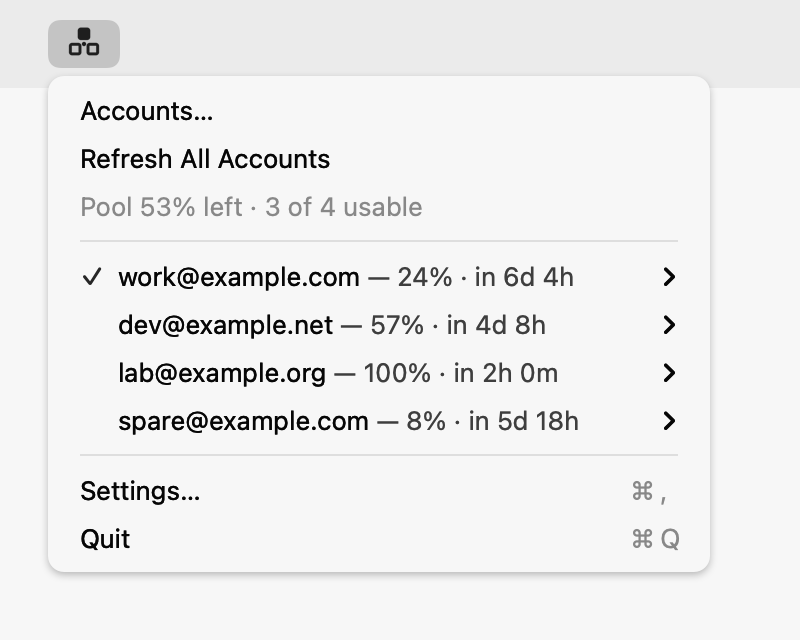
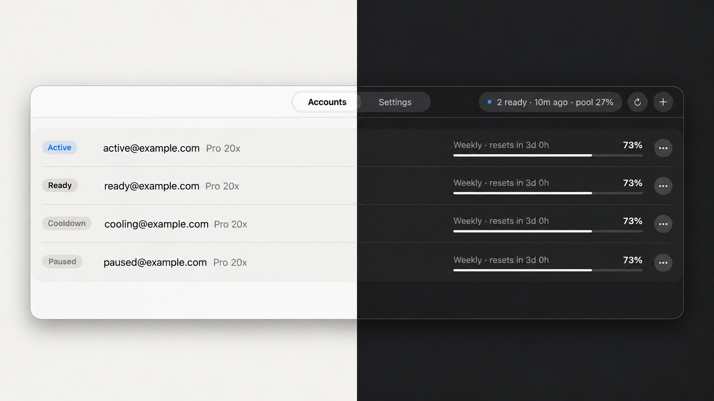
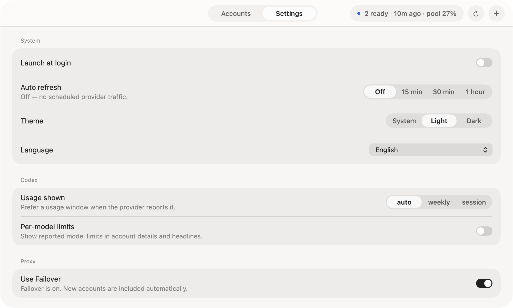

# CodexMulti

[English](README.md) · [한국어](README.ko.md) · [日本語](README.ja.md) · [简体中文](README.zh-CN.md) · **Español**

<p align="center">
  
</p>

**Cuando una cuenta de Codex llegue a su límite, sigue con la siguiente.**

CodexMulti reúne tus cuentas de Codex en una aplicación para la barra de menús de macOS. Consulta el uso y las horas de restablecimiento de cada cuenta, elige su orden y deja que el cambio automático gestione los errores confirmados de límite de uso.

[Descargar](https://github.com/moonsunkim/codexmulti/releases/latest) · [Novedades](CHANGELOG.md) · [Seguridad](SECURITY.md) · [Contribuir](CONTRIBUTING.md)

[](https://github.com/moonsunkim/codexmulti/releases/latest)
[](https://github.com/moonsunkim/codexmulti/actions/workflows/ci.yml)

- **Consulta todas tus cuentas.** El uso, las horas de restablecimiento y los estados del cambio automático aparecen en una sola ventana. La barra de menús muestra un resumen del conjunto; **Cuentas…** abre la lista completa con un clic.
- **Configura el orden una vez.** Arrastra las cuentas para indicar el orden que prefieres. Cuando una solicitud apta encuentra un límite de uso confirmado, el proxy prueba la siguiente cuenta disponible.
- **Activa un solo interruptor.** La configuración incluye el proxy local y su entorno Node. Las cuentas añadidas o reconectadas se incorporan automáticamente mientras la aplicación está abierta.
- **Guarda las credenciales en tu Mac.** Cada cuenta tiene su propio directorio de Codex y una copia en el Llavero. No hace falta crear una cuenta de CodexMulti ni conectarse a un servicio alojado.

<p align="center">
  <picture>
    <source media="(prefers-color-scheme: dark)" srcset="assets/screenshots/menu-bar-dark.png">
    <source media="(prefers-color-scheme: light)" srcset="assets/screenshots/menu-bar-light.png">
    
  </picture>
</p>
<p align="center"><sub><a href="assets/screenshots/menu-bar-light.png">Claro</a> · <a href="assets/screenshots/menu-bar-dark.png">Oscuro</a></sub></p>
<p align="center"><sub>Consulta el porcentaje restante promedio, el uso de cada cuenta y los tiempos de reinicio desde la barra de menús. Se muestran cuentas de ejemplo.</sub></p>

## ¿Qué es el cambio automático y para qué sirve?

Una tarea de programación puede detenerse cuando una cuenta de Codex llega a su límite, aunque otra todavía tenga capacidad. Sin el cambio automático, tendrías que elegir otra cuenta y volver a enviar la solicitud.

**El cambio automático prueba la siguiente cuenta disponible cuando la actual devuelve un error confirmado de límite de uso.** Añade tus cuentas, ordénalas y activa **Usar cambio automático**. CodexMulti dirige las solicitudes aptas de Codex a través de un proxy local en tu Mac.

Por ejemplo, si la cuenta A llega a su límite antes de que empiece la respuesta, el proxy reintenta la solicitud con la cuenta B. Si B también ha alcanzado su límite, prueba la siguiente cuenta apta. Así puedes seguir trabajando sin cambiar de cuenta manualmente ante cada error de límite.

Cada cuenta conserva su suscripción y sus límites; el cambio automático facilita el uso de la capacidad disponible. No reproduce respuestas que ya han empezado ni reintenta todos los tipos de error. Consulta [cuándo cambia de cuenta](#cuándo-cambia-de-cuenta) para conocer las condiciones exactas.

## Instalación

Necesitas **un Mac con Apple Silicon y macOS 26 o posterior**, **Codex CLI 0.146.0 o posterior** con inicio de sesión de ChatGPT y al menos dos cuentas para aprovechar el cambio automático.

```sh
brew install --cask moonsunkim/tap/codexmulti
```

También puedes descargar la [última versión](https://github.com/moonsunkim/codexmulti/releases/latest). Las versiones desde la 0.2.1 están firmadas con Developer ID y notarizadas por Apple.

<details>
<summary>Instalación mediante script o instalación manual</summary>

```sh
curl -fsSL https://raw.githubusercontent.com/moonsunkim/codexmulti/main/install.sh | bash
```

El instalador comprueba el SHA-256 publicado, conserva la aplicación anterior como `CodexMulti.app.previous`, instala en `/Applications` y abre la aplicación en segundo plano. Mantiene los atributos de cuarentena de Gatekeeper.

Para instalar manualmente, descarga `CodexMulti-<version>.zip` y su archivo `.sha256`. Coloca ambos en el mismo directorio y verifica el archivo antes de descomprimirlo:

```sh
shasum -a 256 -c CodexMulti-<version>.zip.sha256
```

Mueve la aplicación verificada `CodexMulti.app` a `/Applications` y ábrela.

</details>

Si ya está instalada, usa **Ajustes → Actualización de software → Buscar actualizaciones**. Si aparece **Configurar actualizaciones seguras**, cierra los clientes de Codex y completa esa configuración inicial. Tú inicias la búsqueda y la instalación. Consulta [Actualizaciones desde la aplicación](#actualizaciones-desde-la-aplicación).

## Dos pasos para empezar

1. **Añade tus cuentas.** Pulsa **+**, asigna un nombre y completa el inicio de sesión oficial en el navegador. Repite el proceso con las cuentas que quieras incluir.
2. **Activa Usar cambio automático.** Abre **Ajustes**. La aplicación prepara el proxy incluido, comprueba que funciona y conecta Codex a él.

Usa Codex como siempre. Si una cuenta devuelve un error confirmado de límite de uso antes de que empiece la respuesta, la misma solicitud puede continuar con la siguiente cuenta apta. Se omiten las cuentas en pausa, no válidas o en espera por haber alcanzado su límite.

Las cuentas añadidas, las reconexiones y los cambios de orden se aplican automáticamente mientras la aplicación está abierta. Los cambios que necesitan recargar el proxy esperan a que terminen las solicitudes activas. Al cerrar la aplicación de la barra de menús, un proxy que funciona correctamente sigue ejecutándose. Al desactivar el cambio automático, se restaura la conexión directa de Codex cuando terminan las solicitudes activas.

Abre **Cuentas…** desde la barra de menús para ver el conjunto completo. En el menú **…** de una cuenta, **Usar en cambio automático…** la selecciona para las nuevas solicitudes. **Pausar en cambio automático** deja de enviarle solicitudes nuevas; **Reanudar en cambio automático** vuelve a incluirla. Las solicitudes en curso continúan con su cuenta actual.

Las filas muestran el porcentaje **usado** del periodo indicado: **100% significa que ese límite está agotado**. El conjunto muestra el promedio de capacidad semanal restante de las cuentas incluidas con uso semanal conocido. Se excluyen las cuentas en pausa y no válidas; las que están en espera por su límite siguen contando en este promedio. No es una suma de tokens ni el número de cuentas listas para recibir solicitudes ahora.

El uso es una instantánea de la última consulta. Actualiza una cuenta desde su menú **…** o usa **Actualizar todas las cuentas**. La actualización programada está **desactivada** por defecto; Ajustes ofrece intervalos de **15 min, 30 min o 1 hora**. Al actualizar también se consulta el estado del proxy local. **Cambiar nombre…** cambia el nombre mostrado en CodexMulti, no el correo de la cuenta de OpenAI.

<p align="center">
  
</p>
<p align="center"><sub>Capturas originales: <a href="assets/screenshots/accounts-light.png">Claro</a> · <a href="assets/screenshots/accounts-dark.png">Oscuro</a></sub></p>

<picture>
  <source media="(prefers-color-scheme: light)" srcset="assets/screenshots/settings-light.png">
  <source media="(prefers-color-scheme: dark)" srcset="assets/screenshots/settings-dark.png">
  
</picture>
<p align="center"><sub><a href="assets/screenshots/settings-light.png">Claro</a> · <a href="assets/screenshots/settings-dark.png">Oscuro</a></sub></p>

Elige el intervalo de actualización del uso, el periodo de uso preferido y el tema. El menú de idioma ofrece **Sistema, English, 한국어, 日本語, 简体中文 y Español**.
El chino disponible es el simplificado (`zh-Hans`); el español usa una traducción común (`es`). La opción Sistema reconoce las variantes regionales del chino simplificado y del español. Todavía no hay traducción al chino tradicional. Las capturas muestran la interfaz en inglés.

<details>
<summary>Consulta los detalles de una cuenta</summary>

Expande una cuenta para ver sus periodos de uso, autenticación, estado del cambio automático, última actualización y restablecimientos disponibles indicados por el proveedor.

Si el proveedor informa de un crédito disponible, el menú de la cuenta puede ofrecer **Restablecer…**. Se comprueba el estado actual y se requieren dos confirmaciones antes de gastar un crédito existente. **Borrar espera…** solo elimina la espera cuando el límite ya se restableció por otra vía; no consume un crédito.

<picture>
  <source media="(prefers-color-scheme: dark)" srcset="assets/screenshots/accounts-expanded-dark.png">
  <source media="(prefers-color-scheme: light)" srcset="assets/screenshots/accounts-expanded-light.png">
  
</picture>
<p align="center"><sub><a href="assets/screenshots/accounts-expanded-light.png">Claro</a> · <a href="assets/screenshots/accounts-expanded-dark.png">Oscuro</a></sub></p>

Todas las capturas usan cuentas ficticias.

</details>

## ¿Cuándo cambia de cuenta?

Solo tras una respuesta confirmada de límite de uso: un HTTP `429` con tipo de error `usage_limit_reached` antes de empezar la transmisión, la misma respuesta durante el establecimiento de un WebSocket o un error `usage_limit_reached` dentro de un WebSocket de Responses antes de que llegue cualquier evento de respuesta al cliente. Cada cuenta apta se prueba como máximo una vez por solicitud.

El cambio manual se aplica a la siguiente solicitud incluso si Codex reutiliza un WebSocket existente. Las respuestas ya iniciadas terminan con su cuenta original. El contexto de la conversación se conserva al cambiar de cuenta; las transmisiones independientes pueden continuar sin interrupción.
Si el contexto completo ya no está en la caché, el cliente debe volver a enviarlo; el proxy no omite el historial de forma silenciosa.

Los fallos de red, los errores `5xx`, las transmisiones interrumpidas, las incompatibilidades de plan, `usage_not_included` y los `429` no reconocidos detienen la solicitud. Una respuesta que ya ha empezado no se reproduce en otra cuenta. Si no queda ninguna cuenta apta, la solicitud falla en lugar de reintentarse indefinidamente.

La aplicación no aumenta los límites de ninguna cuenta ni cambia su suscripción. La compatibilidad del proxy sigue a Codex CLI; consulta las [notas de la versión](https://github.com/moonsunkim/codexmulti/releases/latest) antes de actualizar.

## Tus cuentas se quedan en tu Mac

No hay telemetría, análisis ni un servicio de control alojado por CodexMulti. La autenticación, las consultas de uso y la inferencia se conectan directamente a los servicios del proveedor. El proxy escucha en la interfaz de bucle local y su API de control usa una credencial de acceso privada por usuario.

Cada cuenta usa un directorio de Codex aislado. Las credenciales permanecen en el equipo, con una copia en el Llavero; tu archivo personal `~/.codex/auth.json` no se reemplaza. Activar el cambio automático solo modifica las dos entradas de URL base administradas en `~/.codex/config.toml` y crea una copia con marca de tiempo. Al desactivarlo, se restaura el enrutamiento directo.

Consulta [Seguridad](SECURITY.md) y la [seguridad del proxy](proxy/README.md#state-logs-and-security) para conocer el límite de confianza y el tratamiento de los registros.

## Compilar desde el código fuente

Necesitas Zig 0.16.0 en `PATH`, Xcode (o sus herramientas de línea de comandos) con Swift 6 y el SDK de macOS 26, y macOS 26 en Apple Silicon.

```sh
./app/scripts/fetch-node.sh                                        # Node fijado, SHA-256 verificado
./app/scripts/build-app.sh                                         # → app/dist/staging/CodexMulti.app
./app/scripts/screenshots.sh
./app/scripts/verify-provenance.sh app/dist/staging/CodexMulti.app
./app/scripts/verify-bundled-proxy.sh app/dist/staging/CodexMulti.app
```

La compilación genera el núcleo como un objeto `aarch64-macos`, lo enlaza con el ejecutable Swift y monta el paquete con la versión fijada de Node y el código del proxy. Las marcas de procedencia registran el resumen del código del núcleo, el esquema del puente, el commit del proxy, el resumen de su árbol de archivos y los hashes de Node. `verify-provenance.sh` vuelve a calcularlos en lugar de confiar en el texto.

Pruebas:

```sh
(cd core && zig build test && zig build test-bridge)
(cd app && CODEXMULTI_TEST_HEADLESS=1 swift test)   # no uses swift test sin esta variable: abre ventanas
(cd proxy && npm test)
(cd updater && CODEXMULTI_TEST_HEADLESS=1 swift test)
```

CI comprueba el núcleo Zig, el proxy Node, la interfaz SwiftUI y los scripts de distribución en macOS. El trabajo de SwiftUI usa el SDK de macOS 26.

La firma y el empaquetado para publicar son independientes de la compilación normal. `app/scripts/package-signed-macos.sh` verifica la identidad de firma local, firma primero Node y después la aplicación de dentro hacia fuera, y rechaza los paquetes cuya procedencia o requisito de firma designado no coincidan.

Para añadir o actualizar traducciones, consulta la [guía de mantenimiento de i18n](docs/i18n.md).

## Arquitectura

| Componente | Responsabilidad |
| --- | --- |
| [Aplicación SwiftUI](app/) | Ventanas, menús, accesibilidad e integración con macOS. |
| [Núcleo Zig](core/) | Cuentas, tareas en segundo plano, cambios de enrutamiento protegidos y todo el texto de la interfaz. |
| [Proxy Node](proxy/) | Reenvío local de solicitudes y cambio entre cuentas aptas. |
| [Actualizador nativo](updater/) | Preparación de entornos firmados, control de admisión de solicitudes y recuperación ante fallos. |

La aplicación envía acciones tipadas al núcleo y muestra el estado devuelto. El proxy se ejecuta de forma independiente como LaunchAgent por usuario, por lo que las solicitudes pueden continuar después de cerrar la aplicación de la barra de menús. El proxy y su versión fijada de Node se incluyen en la aplicación. Tras la configuración inicial de actualizaciones, el proxy usa una copia verificada e inmutable en `~/Library/Application Support/CodexMulti/runtimes/`.

### Actualizaciones desde la aplicación

Abre **Actualización de software** en Ajustes. La primera configuración pide cerrar los clientes de Codex porque las instalaciones antiguas no tienen el control atómico de admisión de solicitudes. Las actualizaciones posteriores mantienen el proxy en ejecución mientras se reemplaza la aplicación. Si cambia el entorno del proxy, se espera a que terminen las solicitudes HTTP, las conexiones WebSocket y las renovaciones de credenciales. Una actualización solo de interfaz mantiene el proceso actual del proxy. Las conexiones nuevas pueden fallar brevemente durante un cambio de entorno; las solicitudes activas nunca se cortan por la fuerza ni se reproducen.

Los cambios en las cuentas se pausan durante una actualización. Ajustes muestra la actualización pendiente y permite cancelarla antes de confirmar la detención, o elegir **Desactivar al finalizar las solicitudes**. El agente de actualización sigue ejecutándose aunque se cierre la aplicación de la barra de menús. Si el entorno nuevo no arranca, restaura el entorno compatible anterior. Un proceso activo pero inaccesible requiere recuperación y no se detiene por la fuerza. **Mostrar aplicación anterior** abre la aplicación firmada conservada cuando la instalación necesita recuperación manual.

La búsqueda de actualizaciones está habilitada en versiones publicadas con una fuente HTTPS y una clave pública de Sparkle fijada. Las compilaciones locales sin fuente de actualizaciones indican que la configuración de distribución no está disponible. Consulta el [diseño y las restricciones de actualización](docs/update-design.md) y la [configuración de publicación](docs/updater-release.md).

<details>
<summary>Recuperación, desinstalación y reparación manual del enrutamiento</summary>

La aplicación reintenta la recuperación mientras el cambio automático está activado. Si un cambio debe esperar a las solicitudes activas, su estado explica la espera. Desactiva el cambio automático para restaurar el enrutamiento directo de Codex cuando terminen esas solicitudes.

Si la instalación tiene configuradas las actualizaciones seguras, cierra los clientes de Codex y la aplicación CodexMulti de la barra de menús. Después ejecuta:

```sh
"/Applications/CodexMulti.app/Contents/Helpers/codexmulti-update-agent" prepare-removal \
  --app "/Applications/CodexMulti.app" \
  --config "$HOME/.config/codexmulti/proxy.json"
brew uninstall --cask codexmulti
```

Usa la ruta de tu configuración del proxy si es distinta. La preparación espera a que terminen las solicitudes, restaura solo las entradas de enrutamiento de CodexMulti y elimina su registro de inicio automático. Si informa de `proxy_busy`, el agente sigue esperando; vuelve a preparar la eliminación cuando hayan terminado los clientes. Las credenciales de las cuentas, el historial de uso y los registros de restablecimiento se conservan para futuras instalaciones.

El cask comprueba la preparación explícita de la eliminación antes de borrar la aplicación. Está marcado como `auto_updates`; usa el actualizador de la aplicación para las actualizaciones habituales. Homebrew no distingue de forma fiable entre actualización y eliminación en su script de desinstalación, así que las actualizaciones `--greedy` y las reinstalaciones sin preparar se detienen antes de reemplazar la aplicación. No desactivan el cambio automático sin avisar. `--zap` también elimina los datos guardados de las cuentas. En instalaciones antiguas sin el agente nativo, sigue usando el procedimiento incluido `codexmulti-maintenance prepare-uninstall` antes de desinstalar.

Si la aplicación o el agente no se pueden ejecutar, abre `~/.codex/config.toml` en un editor de texto. Elimina únicamente estas entradas exactas del nivel raíz, si existen, y conserva los demás ajustes:

```toml
chatgpt_base_url = "http://127.0.0.1:8787/backend-api/"
openai_base_url = "http://127.0.0.1:8787/backend-api/codex"
```

La siguiente comprobación solo se aplica a los agentes antiguos que arrancan Node directamente. Los entornos gestionados usan `codexmulti-runtime-launcher`; utiliza el agente nativo o los controles de recuperación anteriores. No detengas por la fuerza un entorno con solicitudes activas.

Después, consulta `launchctl print "gui/$(id -u)/dev.codexmulti.app.proxy"`. Solo si sus argumentos apuntan a `Contents/Helpers/node`, `Contents/Resources/proxy/src/server.mjs`, `--config` y la configuración del proxy de tu aplicación CodexMulti, detenlo con `launchctl bootout "gui/$(id -u)/dev.codexmulti.app.proxy"` y elimina `~/Library/LaunchAgents/dev.codexmulti.app.proxy.plist`. Reinicia los clientes de Codex para que vuelvan a leer la configuración de conexión directa. No reemplaces toda la configuración compartida con una copia antigua.

El control del proxy requiere una credencial de acceso privada por usuario. El tráfico normal del proxy de Codex confía en el equipo local; úsalo únicamente en un Mac cuyos usuarios y procesos locales sean de confianza. Consulta la [seguridad del proxy](proxy/README.md#state-logs-and-security).

</details>

## Licencia

MIT: consulta [LICENSE](LICENSE). Los avisos del Node.js incluido están en [THIRD_PARTY_NOTICES.md](THIRD_PARTY_NOTICES.md).

CodexMulti es un proyecto independiente de código abierto. No está afiliado a OpenAI ni cuenta con su respaldo. Codex es una marca de OpenAI.
