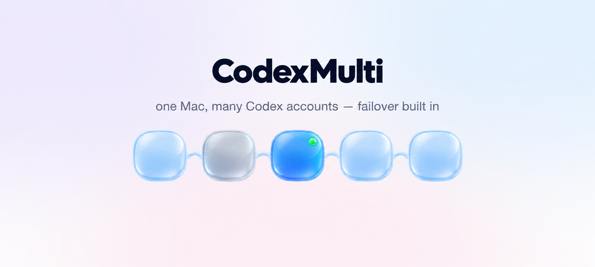
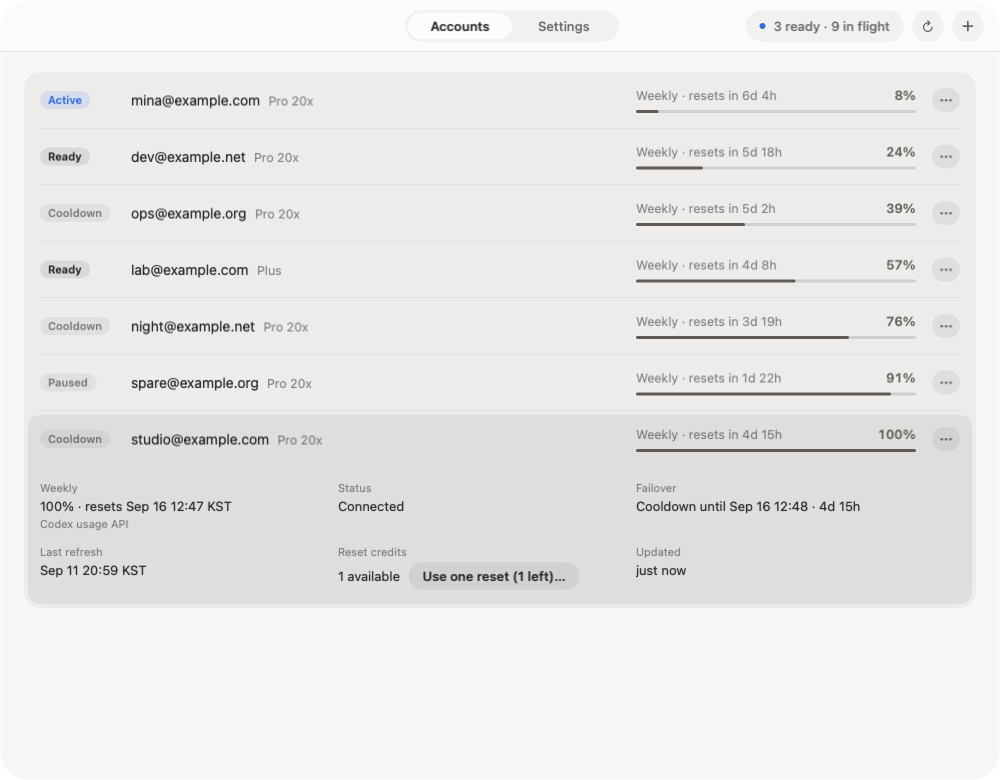
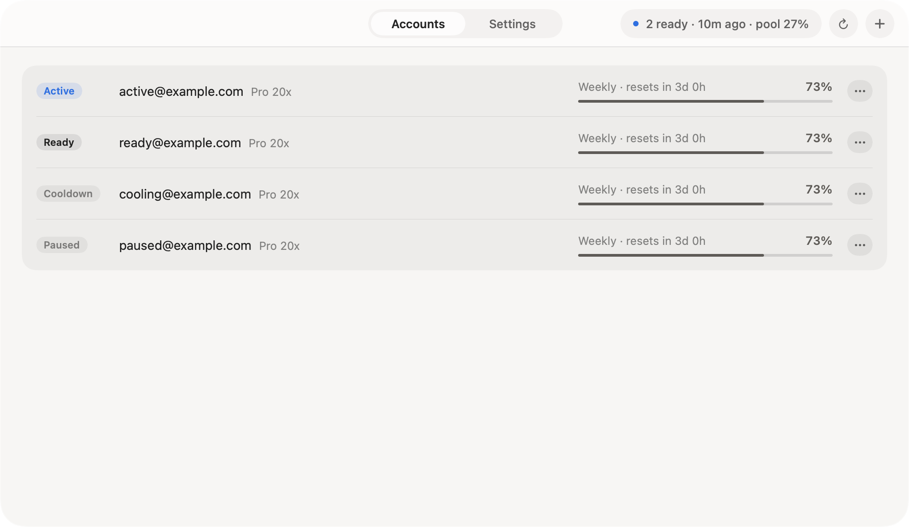
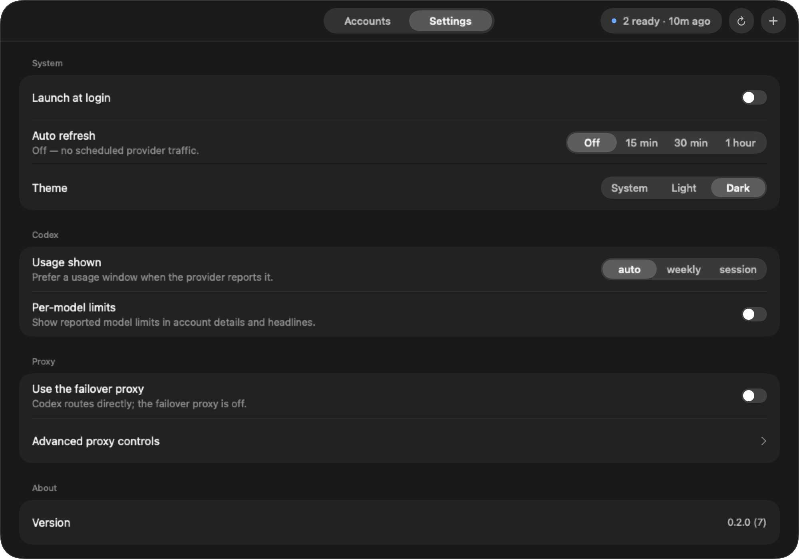

# CodexMulti

[](https://github.com/moonsunkim/codexmulti/actions/workflows/ci.yml)
[Contributing](CONTRIBUTING.md) · [Security](SECURITY.md) · [Changelog](CHANGELOG.md)



*CodexMulti is an independent open-source project and is not affiliated with or endorsed by OpenAI. Codex is a trademark of OpenAI.*

A macOS menu-bar app that keeps several Codex accounts usable from one machine. When the Codex CLI
hits a confirmed weekly limit on one account, the bundled failover proxy retries the same request on
the next eligible account. The proxy and its Node runtime ship inside the app bundle and the app owns
the LaunchAgent that runs them, so installing one `.app` is the whole setup — there is no separate
proxy install and no system Node.js.

## What is in here

| Path | What it is |
| --- | --- |
| `app/` | The SwiftUI menu-bar shell: windows, menus, sheets, accessibility, macOS lifecycle. |
| `core/` | The Zig core: application state, account and proxy logic, and every user-facing string. |
| `proxy/` | The local failover proxy: dependency-free Node, loopback only. |

The shell is a renderer. It draws the core's projection verbatim and sends typed intents back; it does
not reconstruct provider state or business rules. The two meet at the versioned `cm.bridge/1` C ABI.
The core drives the proxy through the proxy's loopback-only v2 control API.

## Requirements

- Apple Silicon Mac, macOS 26 or later
- Codex CLI signed in with ChatGPT authentication
- At least two Codex accounts, or failover has nowhere to go

Proxy transport compatibility tracks the Codex CLI. Check the release notes before upgrading the CLI.

## Install

The installer fetches the latest GitHub release, verifies its published SHA-256, keeps an existing app
as `CodexMulti.app.previous`, installs to `/Applications`, does not remove Gatekeeper quarantine
attributes, and opens the app in the background:

```sh
curl -fsSL https://raw.githubusercontent.com/moonsunkim/codexmulti/main/install.sh | bash
```

With Homebrew:

```sh
brew install --cask moonsunkim/tap/codexmulti
```

For a manual install, download `CodexMulti-<version>.zip` and its matching `.sha256` file from the
[latest release](https://github.com/moonsunkim/codexmulti/releases/latest), put both in one directory,
run `shasum -a 256 -c CodexMulti-<version>.zip.sha256`, expand the verified zip, move
`CodexMulti.app` to `/Applications`, and open it.

The SHA-256 check detects a download that differs from the checksum published with the GitHub
release. A Developer ID signature additionally identifies the Apple developer and notarization adds
Apple's automated review and a stapled ticket. The release notes state `DEVELOPER ID`,
`LOCAL SELF-SIGNED`, or `UNSIGNED` and state `NOTARIZED` or `NOT NOTARIZED`; a self-signed release
provides integrity but not an Apple-verified publisher identity. For any release marked
`NOT NOTARIZED` (which none of the published releases are from 0.2.1 on), macOS blocks the first launch until you approve the app in **System Settings → Privacy & Security**. Neither the installer nor the
manual procedure removes quarantine. There is no automatic updater yet.

## Use

1. **Add accounts.** Choose **Add Codex…**, name the account, and complete the official browser
   sign-in. Repeat for each account in the pool.
2. **Install the proxy service.** In **Settings → Proxy**, install and start it. The app writes the
   per-user LaunchAgent and proxy configuration, then checks local health.
3. **Turn on Codex routing.** Also in **Settings → Proxy**. Installing the service never changes your
   Codex routing silently; it is a separate, explicit action.

From then on the Codex CLI talks to the loopback proxy. Quitting the menu-bar app does not stop a
healthy proxy service. Account order is the failover rotation order — drag rows to change it.

<picture>
  <source media="(prefers-color-scheme: dark)" srcset="assets/screenshots/accounts-expanded-dark.png">
  <source media="(prefers-color-scheme: light)" srcset="assets/screenshots/accounts-expanded-light.png">
  
</picture>

<picture>
  <source media="(prefers-color-scheme: dark)" srcset="assets/screenshots/accounts-dark.png">
  <source media="(prefers-color-scheme: light)" srcset="assets/screenshots/accounts-light.png">
  
</picture>



Settings is grouped as **System** (launch at login, auto refresh, theme), **Codex** (which usage
window the rows show, whether per-model limits appear), **Proxy** (the failover proxy, routing, and
connection paths), and **About**.

### What counts as a failover

The proxy stays on the current account and switches only after a pre-stream HTTP `429` whose provider
error type is `usage_limit_reached`. That account goes into cooldown and the same buffered request is
tried against the next eligible account, at most once per account.

Network failures, TLS errors, `5xx`, interrupted streams, plan mismatches, `usage_not_included` and
unrecognised `429`s do **not** switch accounts — replaying a request whose outcome is unknown is worse
than failing it. Paused, invalid and cooling accounts are skipped until they are eligible again.

## Privacy

No telemetry, no analytics, no hosted control plane. Proxy control traffic never leaves `127.0.0.1`.
The only requests that leave the Mac are the provider calls the Codex CLI would have made anyway.

Account credentials stay on the machine. Each account gets its own isolated Codex home, and the proxy
reads that account's token file in place rather than copying it — tokens never reach the account
registry, the proxy state, the interface or the logs, and your own `~/.codex/auth.json` is never read
or replaced. Logs are bounded and redacted: no labels, credential paths, authorization headers,
cookies, tokens, provider account ids, request bodies or query strings.

The one file of yours the app edits is `~/.codex/config.toml`, and only the two base-URL assignments
that route the CLI through the proxy. Every edit leaves a timestamped backup beside the file, and
turning routing off restores direct access.

## Build from source

You need Zig 0.16.0 on `PATH`, Xcode (or the Command Line Tools) with Swift 6 and the macOS 26 SDK,
and macOS 26 on Apple Silicon.

```sh
./app/scripts/fetch-node.sh                                        # pinned Node, SHA-256 verified
./app/scripts/build-app.sh                                         # → app/dist/staging/CodexMulti.app
./app/scripts/screenshots.sh
./app/scripts/verify-provenance.sh app/dist/staging/CodexMulti.app
./app/scripts/verify-bundled-proxy.sh app/dist/staging/CodexMulti.app
```

The build compiles the core as an `aarch64-macos` object, links it into the Swift executable, and
assembles the bundle with the pinned Node binary and the proxy source. Provenance markers record the
core source digest, the bridge schema, the proxy commit, a digest of the bundled proxy tree, and the
Node hashes; `verify-provenance.sh` recomputes them rather than trusting the text.

Tests:

```sh
(cd core && zig build test && zig build test-bridge)
(cd app && CODEXMULTI_TEST_HEADLESS=1 swift test)   # never plain `swift test`: it opens windows
(cd proxy && npm test)
```

CI runs the Zig core and Node proxy checks on macOS. The SwiftUI shell tests require the macOS 26 SDK and remain a local gate.

Signing and release packaging are separate from the ordinary build: `app/scripts/package-signed-macos.sh`
audits the local signing identity, signs the bundled Node and then the app inside-out, and refuses a
bundle whose provenance or designated requirement does not match.

## Architecture

The shell submits typed intents to one serially owned core handle. The core admits work, advances
what it already admitted, and returns a complete bounded projection; rendering never starts provider
or proxy work. The core also owns guarded LaunchAgent changes and the exact edits to Codex routing.
The proxy runs as its own per-user process, listens only on loopback, and forwards eligible requests
with the selected account's identity.


## License

MIT — see [LICENSE](LICENSE). The bundled Node.js runtime is MIT as well; its notices travel with any
redistributed binary. See [THIRD_PARTY_NOTICES.md](THIRD_PARTY_NOTICES.md).
