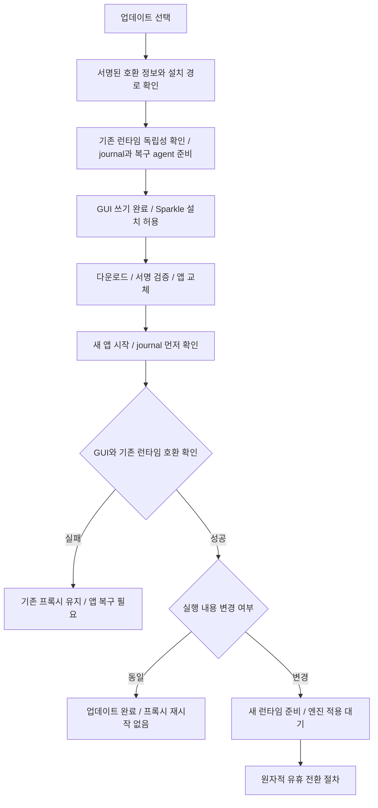

# 앱 업데이트와 프록시 재시작 설계

2026-09-12 · 상태: 설계안. 제품 구현·배포 전.

코드 확인 기준: `8466b0b13ba3473ebb2b954002b854b9c6f76d83`.

## 1. 결정

**앱 파일 교체와 실행 중인 프록시 교체를 두 단계로 분리한다.** Sparkle은 서명된 앱의 다운로드·설치를 담당하고, CodexMulti의 UpdateCoordinator는 프록시 유지·교체·복구를 담당한다. 새 앱이 실행됐다는 이유만으로 프록시를 재시작하지 않는다.

| 상황 | 결정 |
| --- | --- |
| UI만 변경, 프록시 실행 내용 동일 | 앱만 업데이트. 프록시 PID와 연결 유지 |
| 프록시 변경, 처리 중인 작업 있음 | 기존 프록시 계속 사용. 엔진 적용 대기 |
| 프록시 변경, 작업 없음 | 진입 차단과 유휴 확인을 원자적으로 수행한 뒤 교체 |
| 열린 WebSocket 있음 | 메시지가 없어도 사용 중. 연결이 끝날 때까지 대기 |
| 새 프록시가 요청을 받기 전에 기동 실패 | 이전 프록시 자동 복구 |
| 새 프록시가 요청을 받은 뒤 이상 발생 | 같은 유휴 전환 절차로 복구. 살아 있는 요청 강제 종료 금지 |
| 자동 전환 OFF | OFF 유지. 업데이트 때문에 서비스나 라우팅을 켜지 않음 |
| 실행 주체·파일 소유권·호환성 불명 | 설치 또는 엔진 적용 보류 |

첫 버전은 사용자가 업데이트를 한 번 선택하면 다운로드, 앱 재실행, 안전한 엔진 적용까지 이어간다. 사용자 선택 없는 자동 설치는 끈다. 사용자가 허용한 업데이트가 앱 종료 후 설치되더라도 안전하도록 설치 전 준비를 끝낸다. 진행 상태는 앱 안에 표시한다. 별도 알림 기능은 이 설계에 포함하지 않는다.

보장 범위는 **이미 받아 처리 중인 작업을 업데이트가 강제로 끊지 않는 것**이다. 하나의 포트를 두 프로세스가 교대로 사용하는 구조에서는 엔진 교체 순간 새 연결이 잠시 실패할 수 있다. 모든 연결의 무중단 전환은 별도 고정 리스너나 소켓 인계가 필요한 후속 범위다. 요청을 임의로 재전송해서 이 간격을 숨기지 않는다.

## 2. 현재 코드에서 확인한 문제

| 확인된 동작 | 업데이트에 미치는 영향 | 근거 |
| --- | --- | --- |
| LaunchAgent가 앱 번들 안의 Node와 `server.mjs`를 직접 실행 | 앱 교체 후 기존 프로세스가 죽으면 KeepAlive가 다른 버전의 파일로 다시 실행할 수 있음 | `core/src/proxy_service_manager.zig`, `Paths.init`, `renderPlist` |
| `repair`는 요청 수를 다시 읽고 `bootout` 수행 | 0 확인과 종료 사이에 새 요청이 들어올 수 있음 | 같은 파일, `repair`, `waitForZero` |
| HTTP 본문을 모두 받은 뒤 `activeRequests` 증가 | 이미 들어오고 있는 요청도 현재 요청 수에 포함되지 않는 구간 존재 | `proxy/src/server.mjs`, HTTP handler, `proxyRequest` |
| 토큰 갱신과 일부 상태 쓰기는 `activeRequests` 밖에서 실행 | 요청 수 0이어도 인증·쿨다운 저장 중일 수 있음 | 같은 파일, `runTokenRenewalCycle`, `statusPayload` |
| 상태 조회 자체가 쿨다운 만료 처리 등을 수행 | 교체 직전 health 조회를 순수한 읽기로 가정할 수 없음 | 같은 파일, `statusPayload` |
| health는 프로토콜 버전·설정 경로 등을 확인 | 디스크 파일이 새 버전인 것과 실행 프로세스가 새 버전인 것을 구별하지 못함 | `LoopbackHealth`, `FileArtifacts.inspect` |
| 백그라운드 `reconcile`이 서비스를 복구·동기화 | 업데이트와 별도로 `bootout`·`bootstrap` 또는 설정 쓰기가 발생할 수 있음 | `core/src/app_service.zig`, `maintainFailover` |
| 앱 종료는 10초 watchdog 이후에도 허용 | `applicationShouldTerminate`에서 준비를 시작하는 것만으로 영속화 완료 보장 불가 | `app/Sources/CodexMulti/App/AppDelegate.swift` |
| `prepare-uninstall`은 직접 라우팅으로 먼저 복원하고 서비스를 제거 | 업데이트에 재사용하면 사용자의 자동 전환 설정과 서비스 유지 계약을 훼손 | `core/src/proxy_service_manager.zig`, `prepareUninstall` |

본문이 덜 도착한 HTTP 요청을 격리된 가짜 upstream으로 재현했다. 같은 요청에 대해 본문 수신 중 `in_flight=0`, 프록시 처리 진입 후 `1`, 응답 완료 후 `0`이 관측됐다. 응답은 HTTP 200이었다. 실제 계정이나 운영 프록시는 사용하지 않았다. 로컬 근거: `dist/update-design-2026-09-12/current-admission.json`.

현재 코드의 `close()`가 존재한다는 사실도 launchd 종료의 안전성을 증명하지 않는다. 실행 진입점에는 SIGTERM을 이 종료 절차에 연결하는 처리가 없다. 또한 Node의 `closeAllConnections()`는 업그레이드된 WebSocket을 닫지 않는다. [Node HTTP 문서](https://nodejs.org/api/http.html#servercloseallconnections)

## 3. 교체해도 사라지지 않는 실행 기반

앱 번들은 설치 단위로 유지하되, 프록시는 검증된 실행 파일을 앱 밖의 버전별 디렉터리에 복사한 뒤 실행한다.

```text
~/Library/Application Support/CodexMulti/
  runtimes/<runtime_id>/          # 검증 완료 후 내용 변경 금지
    runtime-launcher              # 시작 게이트와 OS writer lock
    node
    proxy/
    runtime-manifest.json
  updates/<transaction_id>/
    journal.json                 # 상태·기대값, 인증 정보 제외
    recovery-agent               # 서명된 독립 실행 파일
    previous-app/                # 검증된 이전 앱 복구본
  active-runtime.json            # 확정된 실행 대상과 활성화 세대
  update.lock                    # 교체 소유자 1개
  runtime-writer.lock            # 실행 엔진의 상태 writer 1개
```

기존 계정·인증·설정·쿨다운 파일은 현재의 안정된 저장 위치를 유지한다. 업데이트 때문에 전체 데이터를 이동하거나 `~/.codex`를 복제하지 않는다.

- LaunchAgent의 인자는 특정 `runtimes/<runtime_id>/`의 절대 경로를 가리킨다. 앱 번들이나 변경 가능한 `current` 심볼릭 링크를 실행 대상으로 사용하지 않는다.
- 서명된 native runtime-launcher가 시작 조건을 검사하고 OS writer lock을 취득한 뒤 Node를 실행한다. 잠금은 실제 Node 프로세스가 종료될 때까지 유지해야 한다. launcher만 죽었을 때 자식이 잠금 없이 남지 않도록 FD 상속·프로세스 수명을 검증한다. JavaScript의 boolean이나 PID 파일로 배타성을 대신하지 않는다.
- 런타임 디렉터리는 임시 경로에 완성하고 무결성을 검사한 뒤 rename으로 공개한다. 실행 중인 디렉터리를 덮어쓰지 않는다. symlink 탈출·잘못된 소유자·쓰기 권한이 열린 경로는 거부한다.
- `runtime_id`는 프록시 실행 트리, 서명 전 Node 내용, 아키텍처, 런처 ABI의 정규화된 해시로 계산한다. 앱 버전·빌드 시각·서명 시각을 섞지 않아 UI 업데이트의 불필요한 재시작을 막는다.
- Developer ID와 실제 서명된 Node 해시는 별도로 검사한다. 같은 `runtime_id`의 기존 검증본이 있으면 재서명된 파일로 덮어쓰지 않는다. 보안상 재활성화가 필요하면 서명된 manifest의 명시적인 activation revision을 올린다.
- 확정된 런타임과 직전 정상 런타임을 보관한다. 실행 프로세스·LaunchAgent·미완료 transaction·복구본이 참조하는 경로는 정리하지 않는다.

이 구조에서는 앱 업데이트 중 기존 프록시가 우발적으로 재기동해도 같은 런타임으로 돌아온다. 자연적인 프로세스 장애가 기존 요청을 끊는 경우까지 업데이트가 복원할 수 있다는 뜻은 아니다.

## 4. 소유권과 영속 상태

UpdateCoordinator는 GUI의 메모리 안에만 두지 않는다. transaction마다 서명된 recovery-agent를 앱 밖에 준비하고 사용자 launchd job으로 실행한다. GUI가 종료되어도 작업을 이어가며, agent가 죽으면 같은 transaction을 복구한다. 종료 상태를 영속화한 뒤 job을 해제한다. 상시 네트워크 데몬은 추가하지 않는다.

역할은 분명하게 나눈다.

| 주체 | 책임 |
| --- | --- |
| Sparkle | 피드·배포물 검증, 앱 번들 교체, 앱 재실행 |
| Recovery agent / UpdateCoordinator | 업데이트 journal, 서비스 교체 권한, 런타임 선택·복구 |
| 프록시 프로세스 | 작업 진입 관리, 순수 상태 조회, 자신이 실행 중인 내용·boot ID 보고 |
| 새 GUI/core | 시작 전 journal 확인, 구 런타임 호환 확인, UI 준비 완료 보고 |

`update.lock`은 OS advisory lock으로 획득한다. 파일 존재만 보고 잠금을 판단하거나 PID만으로 이전 작업을 삭제하지 않는다. 기존 `reconcile`, 설정 동기화, 서비스 ON/OFF, CLI maintenance도 같은 coordinator를 거쳐 서비스 변경을 직렬화해야 한다. 업데이트 대기 중 일반 요청·토큰 갱신은 계속된다. 긴 업데이트 잠금이 프록시의 평상시 인증 쓰기를 막아서는 안 된다.

공유 설정 변경에는 별도 짧은 mutation lock과 revision을 사용한다. 런타임 전환 직전에는 새 mutation을 잠시 막고 이미 시작한 작업을 기다린다. GUI가 계정 변경을 요청하면 대기 단계에서는 적용 후 revision을 갱신할 수 있다. 전환이 시작됐으면 작업을 대기시키거나 명시적인 busy를 반환하며 유실시키지 않는다. 서비스 OFF나 업데이트 취소 같은 사용자 명령도 동일한 상태 머신에 전달한다.

journal에는 transaction UUID, 단조 증가 epoch, phase, 설치 출처, 이전·대상 앱 build, 이전·대상 runtime ID, manifest digest, 원하는 ON/OFF 상태, 설정 경로·revision, LaunchAgent digest, 예상 boot UUID, 활성화 세대, 실패 원인을 기록한다. 토큰·계정 비밀·요청 본문은 기록하지 않는다. 제어 capability는 별도의 0600 파일/로컬 IPC로 전달하며 로그나 argv에 넣지 않는다.

모든 파괴적 단계 전에 의도를 atomic write·fsync로 기록하고, 실행 후 실제 관측 결과를 기록한다. 복구는 journal 한 줄만 믿지 않고 코드 서명, launchd 인자, PID의 시작 시각, boot UUID, writer lock, 포트 소유자를 함께 대조한다. 연결 불가를 프로세스 종료로 간주하지 않는다.

각 실행에는 OS 재부팅 ID와 구분되는 새 process boot UUID를 부여한다. journal과 active 선택을 두 파일의 동시 갱신으로 가정하지 않는다. 활성화 결정은 `active-runtime.json`의 세대가 기준이며, journal만 다음 단계이고 active 선택이 이전 상태라면 아직 활성화하지 않은 것으로 복구한다. 실제 프로세스가 보고한 세대가 파일과 다르면 추가 변경을 보류한다.

런타임 시작 게이트는 HTTP 리스너와 토큰 갱신보다 먼저 실행된다. 앱 설치 준비·설치·idle 대기 단계에서는 기존 active 런타임의 정상 재기동을 허용한다. `STOP_COMMITTED`부터 `VERIFYING`까지는 재기동한 구·신 프로세스를 모두 gated 상태로 시작하고 recovery-agent의 명시적인 활성화를 기다린다. 따라서 KeepAlive, 로그인, agent 재시작이 임의로 요청을 다시 받게 만들지 않는다. 상태가 손상돼 판별할 수 없으면 일반 `repair`도 자동 실행하지 않는다.

## 5. 앱 설치 단계



1. 설치 대상의 서명된 호환 정보로 현재 런타임을 새 GUI가 사용할 수 있는지 확인한다. 쓰기 가능한 정식 설치 경로, 지원 OS·CPU, 배포 채널, 이전 앱 복구본과 새 앱·런타임을 함께 둘 공간도 확인한다. 개발용·translocation·다른 사용자 소유 설치는 이 경로로 갱신하지 않는다.
2. 실행 중인 프록시가 이미 버전별 독립 경로를 사용하며 update protocol을 지원하는지 확인한다. 기존 런타임을 복사해 놓는 것만으로 현재 실행 프로세스의 인자가 바뀐 것으로 간주하지 않는다.
3. recovery-agent와 이전 앱 복구본을 검증하고 `APP_PREPARED`를 영속화한다. 기존 GUI의 상태 변경·로그인·갱신 작업을 완료하거나 안전하게 중단하고 저장을 마친다. 이후 이전 GUI는 새 쓰기를 시작하지 않는다. 준비 완료 전에는 Sparkle 설치를 허용하지 않는다.
4. Sparkle이 앱을 교체하는 동안 기존 프록시는 계속 요청과 인증 갱신을 처리한다. 업데이트 때문에 `prepare-uninstall`, 라우팅 OFF, 프록시 restart를 호출하지 않는다.
5. 새 앱은 일반 core maintenance보다 먼저 journal을 읽는다. 설치된 실제 build·manifest와 서명된 기대값을 비교하고, 데이터 읽기 및 구 런타임 제어 호환성을 확인한다. 부작용이 있는 자동 복구·마이그레이션은 아직 실행하지 않는다.
6. 새 GUI의 초기 화면과 core bridge가 정상 준비됐다는 receipt를 recovery-agent에 전달한다. 단순 PID 생성은 성공이 아니다. 불일치나 앱 초기화 실패 시 구 런타임을 유지하고 `APP_RECOVERY_REQUIRED`로 남긴다.
7. 런타임 내용이 같으면 기존 실행 boot ID를 확인하고 완료한다. 다르면 새 앱에서 검증한 런타임을 별도 경로에 준비하고 아래 전환 절차를 수행한다.

다운로드·설치가 취소되거나 실패해 이전 앱을 계속 사용할 때는 Sparkle에 예약된 설치가 남아 있지 않음을 먼저 확인하고 GUI 쓰기를 다시 연다. 설치 여부를 확인하지 않은 채 `APP_PREPARED`를 지우지 않는다.

### Sparkle 통합 시 지켜야 할 경계

`SUAllowsAutomaticUpdates=false`, 자동 다운로드·설치 설정 OFF를 첫 버전 정책으로 고정한다. `SUAutomaticallyUpdate`를 다운로드 전용 옵션으로 취급하지 않는다. [Sparkle 설정 문서](https://sparkle-project.org/documentation/customization/)

전용 `SPUUserDriver`에서 **최초 INSTALL 응답 전**에 `APP_PREPARED`를 보장한다. 다운로드 이후 앱 종료만으로 설치가 진행되는 경로까지 이미 안전해야 한다. ready callback이나 `shouldPostponeRelaunchForUpdate`만 기다리면 누락 경로가 생긴다. `willInstallUpdate`는 사후 준비용 veto가 아니다. [SPUUserDriver 계약](https://github.com/sparkle-project/Sparkle/blob/2.x/Sparkle/SPUUserDriver.h), [SPUUpdaterDelegate 계약](https://sparkle-project.org/documentation/api-reference/Protocols/SPUUpdaterDelegate.html)

앱이 설치되어 돌아왔는지는 새 프로세스와 agent가 판정한다. 이전 GUI의 update-cycle 완료 callback으로 전체 업데이트를 완료 처리하지 않는다. 피드의 호환 정보와 실제 번들 manifest가 다르면 새 앱이 일반 서비스를 시작하기 전에 보류한다.

## 6. 프록시 교체 프로토콜

기존 status version 2는 유지하고 별도의 `update_protocol: 1` capability를 추가한다. update protocol이 없는 프록시에는 이 절차를 시도하지 않는다. agent와 프록시는 기존 인증된 loopback 제어면의 `/_proxy/update/v1/` 경로를 사용하고, 기존 로컬 요청·인증 검사를 유지한다. GUI와 agent는 같은 UID를 확인하는 0600 Unix socket을 사용한다. 일반 프록시 요청의 인증과 업데이트 제어 권한을 혼동하지 않는다.

### 작업 카운터의 의미

상태 표시용 `in_flight`와 종료 안전성을 결정하는 `work`를 구분한다. `work`는 다음 모든 작업의 ticket 집합이다.

- HTTP: 헤더를 받아 요청을 인식한 직후, 본문을 기다리기 전에 취득. 본문 수신·upstream 전송·응답 스트림·연관된 저장 작업 종료까지 유지.
- WebSocket: 업그레이드 처리 전 취득. 연결 전체 수명과 정리 완료까지 유지. 조용한 연결도 1개다.
- 토큰 갱신, 계정/설정 reload, pause·cooldown 변경 등 제어 쓰기, 예약된 영속화 작업: 첫 비동기 단계 전에 취득하고 durable write까지 유지.

ticket 취득, 준비 요청의 0 확인, 새 진입 차단은 같은 admission mutex에서 처리한다. 중복 완료·취소에서도 ticket은 정확히 한 번 반환한다. 순수 health 조회는 ticket 없이 가능하되 상태를 변경하지 않는다. TCP 연결만 열려 있거나 아직 HTTP 헤더가 완성되지 않은 소켓은 처리 수락된 요청으로 보지 않는다. 해당 연결은 전환 때 실패할 수 있다.

### 제어 명령

| 명령 | 원자적 조건과 결과 |
| --- | --- |
| `prepare-if-idle(txn, epoch, boot_id, runtime_id, config_revision)` | ID와 revision 일치 확인. work가 있으면 `BUSY`와 종류별 수만 반환하고 게이트는 열어 둠. 0이면 같은 mutex 안에서 데이터·새 writer 진입을 닫고 lease 발급 |
| `renew-lease / abort-prepare` | 같은 txn·epoch·boot에 한정. stop commit 전이고 활성 대상이 기존 런타임임이 확인된 경우만 연장·재개 가능 |
| `commit-stop(lease)` | 영속화 완료, work=0, 배타적 mutation barrier를 재검사하고 `STOP_COMMITTED` 기록. 이후 lease 만료로 임의 재개 금지 |
| `health` | runtime ID, 실제 payload 검증 결과, boot UUID, config 경로·revision, gate 상태, 활성화 세대, work 종류별 수 반환. 읽기 전용 |
| `activate(txn, epoch, generation)` | durable active 선택과 시작 manifest가 일치하고 writer 권한을 가진 candidate만 게이트를 엶. 같은 명령 재호출은 멱등 |

만료된 epoch, 다른 boot ID, 이전 transaction의 중복 명령은 변경 없이 거부한다. lease 값은 추측 불가능하게 만들고 인증된 채널로만 전달한다. lease 갱신·상태 조회 자체는 work=0 판정을 영원히 방해하지 않아야 한다.

### 실행 순서와 commit 지점

1. **WAITING_IDLE**: 기존 프록시가 정상 서비스한다. work가 끝나는 이벤트 후 `prepare-if-idle`을 시도하고, 이벤트를 놓친 경우에만 제한적으로 재조회한다. 바쁜 동안 요청을 먼저 막아 강제로 빈 상태를 만들지 않는다.
2. **QUIESCENT**: 원자적인 준비가 성공했다. 새 요청에는 `503 proxy_updating`을 반환하고 WebSocket handshake를 수락하지 않는다. 이미 수락한 작업은 0이며, 보류 중인 state write도 모두 끝나야 한다. 설정 revision이 달라졌다면 중단 후 기존 서비스를 다시 연다.
3. **STOP_COMMITTED**: 영속 journal에 stop 의도를 먼저 기록한다. 기존 런타임은 이 상태에서 다시 admission을 열 수 없다. 정확한 launchd label, 인자, 프로세스 시작 ID를 재확인한 뒤 해당 job만 `bootout`한다. 프로세스 종료와 writer lock 해제를 모두 확인한다.
4. **CANDIDATE_GATED**: 새 경로의 LaunchAgent를 설치하고 candidate를 시작한다. candidate는 writer lock을 확보해도 아직 OAuth 갱신, 상태 변경, upstream 요청을 시작하지 않는다. startup gate 상태로 포트에 bind하고 순수 health에만 응답한다.
5. **ACTIVATION_COMMITTED**: build·runtime ID·boot UUID·설정·프로토콜·서명과 startup gate의 일치를 확인한다. `active-runtime.json`의 새 활성화 세대를 원자적으로 확정한 뒤 `activate`를 보낸다. 이 durable 선택이 활성화 결정의 기준이다. agent가 여기서 죽어도 같은 candidate로 이어간다.
6. **VERIFYING**: 새 프로세스의 활성화 receipt와 실제 health를 확인한다. 그 사이 요청이 들어와도 성공 판정에 work=0을 다시 요구하지 않는다. callback·명령 성공·디스크 버전만으로 완료하지 않는다.
7. **COMPLETE**: 새 GUI 준비, 의도한 런타임의 실제 활성 상태, 사용자의 라우팅 ON/OFF 유지가 모두 확인된 경우에만 완료한다. 이전 런타임과 복구 근거는 남긴다.

정상 동작 중인 프로세스를 강제로 죽여 시간 제한을 맞추지 않는다. `bootout` 이후의 짧은 포트 공백은 허용하되, 다른 프로세스가 포트를 쓰면 그 프로세스를 종료하지 않고 전환을 실패 처리한다.

rollback도 같은 활성화 절차를 따른다. journal에 복구 의도를 기록하고 candidate 정지를 확인한 뒤 이전 런타임을 gated 상태로 기동한다. health 확인 후 **증가한 새 세대**로 이전 runtime ID를 선택하고 활성화한다. 오래된 `active-runtime.json`을 그대로 복사하거나 generation을 되돌리지 않는다. 실패한 candidate의 늦은 activate 응답은 이 새 세대에 영향을 줄 수 없다.

## 7. 장애·취소·복구

| 발생 지점 | 처리 |
| --- | --- |
| 다운로드 실패, 서명 오류, 공간 부족 | 설치를 중단하고 기존 앱·프록시 유지. partial staging만 transaction 소유권 확인 후 정리 |
| 앱 교체 도중 GUI 종료·충돌 | agent가 실제 앱 build와 Sparkle 작업 상태 확인. 구 런타임 유지. 설치 완료·실패가 불명확하면 중복 설치 금지 |
| 새 GUI 준비 실패 | 엔진 변경 금지. 이전 프록시 계속 사용. 보관한 서명된 이전 앱의 복구 경로 제공 |
| WAITING_IDLE에서 취소 | 엔진 적용 취소. 이미 설치된 새 GUI와 기존 호환 런타임을 유지하며 미적용 상태를 명시 |
| QUIESCENT에서 취소·agent 장애 | stop commit이 없고 기존 active가 유효할 때만 재개. 판별 불가하면 recovery-agent가 소유권 복구 후 결정 |
| stop commit 후 agent 장애·재부팅 | journal과 실제 프로세스를 비교해 미완료 전환 복구. 구·신 런타임 어느 쪽도 journal을 무시하고 자동으로 트래픽을 열지 않음 |
| 기존 프로세스 종료 확인 실패 | candidate를 시작하지 않음. 강제 kill하지 않으며 안전한 상태 확인 전까지 보류 |
| candidate 기동·무결성·설정 읽기 실패 | 트래픽을 열기 전 실패이므로 candidate 정지 확인 후 이전 런타임을 새 세대로 선택하는 복구 절차 수행 |
| activate 응답 유실 | 이미 새 요청을 받았을 수 있음. active 세대·boot·gate를 조회해 같은 transaction을 계속함. 즉시 재시작 금지 |
| 활성화 후 새 런타임 이상, 프로세스 살아 있음 | 동일한 prepare 절차로 이전 런타임 복귀. busy면 대기. health timeout만으로 kill 금지 |
| 활성화 후 새 런타임의 실제 사망 확인 | writer 해제 확인 후 호환되는 이전 런타임으로 복구. 처리 결과 불명인 요청은 자동 재전송하지 않음 |
| 이전 런타임 복구도 실패 | `RECOVERY_REQUIRED`. 원인과 수동 복구 경로 표시. 라우팅을 몰래 OFF로 바꾸거나 성공 처리하지 않음 |
| 다른 설치기·Finder가 앱/서비스 파일 변경 | 기대값 불일치로 보류. 제3자가 바꾼 파일을 자동 덮어쓰기·삭제하지 않음 |

GUI까지 자동으로 이전 버전으로 되돌리는 것은 첫 버전의 보장에 포함하지 않는다. Sparkle의 앱 교체와 별개로 **런타임 자동 복구**를 구현한다. GUI 복구는 남겨 둔 서명된 이전 앱과 명시적 복구 동작을 사용한다. 앱 다운그레이드가 자동으로 된다고 표시하지 않는다.

### 시간과 재시도

- idle 대기에는 강제 종료 시한이 없다. 계속 열린 WebSocket은 몇 시간이 지나도 그대로 둔다. 사용자가 연결을 끝내거나 적용을 취소할 수 있다.
- 초기 제안값: prepare lease 10초, 갱신 2초, stop 확인 10초, candidate 준비 15초, 새 GUI 준비 30초. 이는 실패 판정과 복구 착수를 위한 값이며 요청을 끊을 권한이 아니다. 실기기 검증 후 조정한다.
- sleep 시간을 성공으로 계산하지 않는다. wake 뒤 lease·boot·프로세스 소유권을 재검사한다. 재부팅은 만료 시간 추정 대신 journal 복구로 다룬다.
- 자동 복구는 이전 런타임으로 한 번 수행한다. 실패한 대상 build는 해당 transaction에서 다시 활성화하지 않는다. 명시적인 재시도나 새 배포가 오기 전에는 루프를 돌지 않는다.
- 앱 설치가 이미 시작된 뒤 취소 요청이 들어오면 현재 단계를 안전하게 마치거나 복구한다. 실행 중인 Sparkle installer를 kill하지 않으며, 완료 전까지 취소 완료로 표시하지 않는다.

## 8. 데이터와 호환성

업데이트는 자동 전환 ON/OFF, 계정 ID·순서·pause, cooldown·cursor, 인증 파일, 설정 경로를 보존한다. 다만 구 런타임이 계속 서비스하며 정상적으로 바꾼 cooldown·cursor·갱신 토큰은 최신 상태를 유지해야 한다. 업데이트 시작 시점의 값으로 덮어쓰는 것을 보존으로 취급하지 않는다.

릴리스 manifest에 GUI가 제어 가능한 runtime protocol 범위, runtime의 설정·상태 읽기/쓰기 schema 범위, 이전 런타임으로 되돌릴 수 있는 범위를 선언한다. 실제 설치 경로마다 호환성을 판정한다. 단순히 `N-1 지원` 문구만 두고 여러 버전을 건너뛰는 업데이트를 허용하지 않는다.

첫 버전의 자동 경로에서는 다음을 요구한다.

1. 새 GUI가 기존 런타임을 계속 사용할 수 있다.
2. 새 런타임이 기존 데이터를 읽을 수 있다.
3. 새 GUI·런타임이 쓴 데이터를 직전 정상 런타임과 보관한 이전 GUI가 읽고 필요한 상태를 손실 없이 보존할 수 있다.
4. 비가역 마이그레이션은 없다. 필요하면 서명된 중간 릴리스를 먼저 거치거나 별도 유지보수 업데이트로 분리한다.

OAuth refresh token은 전체 snapshot 복원 대상에서 제외한다. 새 토큰이 발급된 뒤 과거 인증 파일을 복원하면 복구 자체가 로그인을 망가뜨릴 수 있다. 업데이트가 직접 변경한 서비스 선택·plist만 범위를 좁혀 복원하며, 사용자나 기존 프록시가 정상적으로 변경한 데이터는 유지한다.

자동 전환 OFF 상태에서는 프록시를 기동해 확인하지 않는다. 검증된 새 런타임을 다음 활성화 대상으로 등록하고 설정을 유지한다. 업데이트 도중 사용자가 OFF를 요청하면 coordinator가 그 의도를 먼저 영속화하고 ON으로 되돌리지 않는다. 실제 종료는 동일한 안전한 작업 종료 절차로 처리한다.

## 9. 최초 도입과 설치 경로

현재 배포된 0.2.4에는 독립 런타임 실행·원자적 준비 프로토콜·앱 updater가 없다. 이 버전에서 첫 지원 버전으로 넘어가는 과정은 자동 업데이트로 소급 보장할 수 없다.

**최초 도입은 한 번의 유지보수 설치로 한다.** 프록시를 쓰는 클라이언트를 종료하고, 소유한 구 서비스를 정지한 뒤 새 실행 구조로 등록한다. legacy `in_flight=0`만 보고 사용 중 설치를 허용하지 않는다. 최초 앱 실행 시 이미 구 서비스가 살아 있으면 `MIGRATION_REQUIRED`로 남기고 자동 `repair`를 막는다. 새 구조로 실행 중임이 확인된 뒤부터 일반 업데이트 경로를 연다.

이 최초 이동에서도 기존 ON/OFF 의도를 먼저 저장한다. ON이었던 경우 새 런타임의 실제 정상 상태를 확인한 뒤 기존 라우팅을 유지·복원하고, OFF였으면 서비스를 켜지 않는다. 구 서비스를 멈추고 파일만 복사한 상태를 이동 완료로 처리하지 않는다.

Homebrew도 별도 경로로 취급해야 한다. 현재 cask는 upgrade 때도 `prepare-uninstall` 스크립트를 실행한다. `on_upgrade: :quit`만으로 스크립트 실행이 제한되지는 않는다. 현지 Homebrew 구현도 직접 확인했다. [Homebrew Cask uninstall 문서](https://docs.brew.sh/Cask-Cookbook#stanza-uninstall)

첫 updater 배포 전 다음을 함께 해결한다.

- 앱 내 업데이트를 지원하는 cask로 전환하고 `auto_updates true`를 선언한다. 일반 `brew upgrade`와 앱 updater의 중복 기회를 줄이되, 이것을 잠금 보장으로 취급하지 않는다.
- upgrade/reinstall과 실제 uninstall을 구별하는 Homebrew 연동을 실제 lifecycle hook에서 구현한다. 명령 인자가 없는 기존 uninstall script 안에서 추측하지 않는다. upgrade/reinstall은 독립 런타임과 사용자 라우팅을 유지하고 같은 update lock을 획득해야 한다.
- `brew upgrade --greedy`, reinstall, 수동 설치를 각각 검증한다. 해당 Homebrew lifecycle에서 앱 교체 전 동일한 준비 계약을 보장할 수 없다면 그 경로를 지원한다고 배포하지 않는다. 실제 uninstall만 서비스 종료·라우팅 원복을 수행한다.
- Finder의 임의 덮어쓰기와 과거 cask는 협력 잠금을 지키지 않을 수 있다. 이 경로의 완전한 중단 방지는 보장하지 않는다. 독립 런타임으로 피해를 제한하고 다음 시작에서 실제 파일과 journal을 대조한다.

현재 cask의 upgrade hook을 둔 채 updater만 추가하는 것은 출시 조건을 충족하지 않는다.

## 10. 배포 신뢰와 완료 상태

배포는 HTTPS 피드, EdDSA 배포물 서명, 고정된 Developer ID, notarization, 대상 OS·아키텍처 검증을 사용한다. 앱에 공개키를 고정하고 피드 서명을 지원하는 Sparkle 버전을 고정해 signed feed를 요구한다. 설치 허용 전에 쓰는 호환 필드도 서명 범위에 넣는다. [Sparkle 배포 문서](https://sparkle-project.org/documentation/publishing/)

같은 버전 URL의 배포물을 바꾸지 않는다. ZIP과 manifest를 검증해 공개한 다음 해당 피드 항목을 노출한다. 취소된 릴리스는 새 설치 제안에서 제외하되, 이미 처리 중인 프록시를 강제 종료하지 않는다. 실패 build의 반복 설치·런타임 왕복을 막는다.

앱에는 다음 상태를 구별해 표시한다.

| 상태 | 표시 예시 |
| --- | --- |
| 다운로드·앱 설치 | `업데이트를 준비하고 있습니다` |
| 새 앱 설치, 기존 엔진 계속 실행 | `앱 업데이트 완료 · 엔진 적용 대기` |
| 연결 때문에 대기 | `열린 연결이 끝나면 업데이트를 마칩니다` |
| 엔진 교체 중 | `엔진 업데이트 중` |
| 모든 조건 충족 | `업데이트 완료` |
| 엔진 복구 성공 | `엔진 적용 실패 · 이전 엔진으로 복구됨` |
| 앱 또는 엔진 수동 복구 필요 | `업데이트를 완료하지 못했습니다 · 복구 필요` |

앱 버전과 실행 엔진 버전은 진단 상세에 각각 남긴다. 자동 전환이 OFF이고 서비스도 정지한 경우에는 다음 실행 대상의 검증과 OFF 보존을 완료 기준으로 사용한다. 계정이 없더라도 서비스가 실행 중이면 실제 runtime identity를 확인한다. 실제 계정으로 유료 upstream 요청을 보내는 것은 업데이트 성공 검사에 포함하지 않는다.

## 11. 구현 순서와 출시 조건

1. **실행 기반 분리**: versioned runtime, 시작 게이트, runtime/boot identity, 호환 manifest. 기존 앱이 종료돼도 같은 엔진으로 재기동되는지 먼저 확인한다.
2. **안전한 전환 API**: HTTP 본문 수신 전 ticket, WebSocket·인증·상태 쓰기 추적, 원자적 prepare, 순수 health. 기존 자동 `repair`도 이 API를 따르게 한다.
3. **복구 가능한 coordinator**: journal·agent·세대·서비스 변경 직렬화, gated candidate, commit·복구. 이 단계에서 가짜 런타임으로 모든 중단 지점을 검증한다.
4. **앱 updater 연결**: Sparkle user driver, 최초 설치 허용 경계, 새 GUI receipt, 취소·대기 UX. 기존 종료 watchdog에 안전성 책임을 맡기지 않는다.
5. **첫 도입과 배포 통합**: maintenance migration, Homebrew lifecycle, 실제 서명 앱 두 버전의 설치·복구 검증.

필수 검증은 아래 결과를 실제로 관측하는 것이다. 테스트 항목을 만든 사실이나 `launchctl` 종료 코드만으로 출시하지 않는다.

| 시나리오 | 통과 기준 |
| --- | --- |
| UI만 변경 | 앱 버전은 변경되며 프록시 PID·boot ID·열린 연결 유지 |
| 느린 HTTP 본문·SSE 스트림 | 본문 수신부터 마지막 응답·저장까지 전환되지 않고 응답 완결 |
| idle 확인과 동시에 들어오는 요청 | ticket 획득 후 대기되거나 gate에서 거부됨. 수락된 요청을 중간에 끊지 않음 |
| 조용한 WebSocket·연속 메시지 | 전체 연결 동안 적용 대기, 연결 종료 후 전환 |
| 토큰 갱신·cooldown 저장·계정 수정 경쟁 | 저장 완료 전 교체 금지, 재시작 뒤 최신 상태 유지 |
| candidate 기동·포트 bind·설정 파싱 실패 | 새 엔진이 요청을 받기 전에 이전 엔진 자동 복구 |
| activate 직후 응답 유실과 신규 요청 | 같은 세대를 복구하며 요청 중 중복 재시작 없음 |
| 각 durable phase 전후 agent SIGKILL | 중복 writer·중복 서비스·잘못된 성공 없이 resume/rollback |
| 앱 강제 종료, quit-without-relaunch, 설치 예약 뒤 종료 | APP_PREPARED 우회 불가, 구 프록시 유지 |
| 10초 GUI 종료 watchdog | 미완료 앱 쓰기를 남긴 상태로 설치 허용하지 않음 |
| 잠자기·재부팅·KeepAlive 재기동 | journal 복구 전 구·신 프로세스의 임의 admission 없음 |
| proxy health timeout이나 PID 재사용 | 살아 있는 다른 프로세스를 종료하지 않음 |
| 토큰 회전 후 런타임 rollback | 최신 인증 정보 유지, 이전 snapshot 복원 없음 |
| ON/OFF 상태와 업데이트 중 OFF 명령 | 마지막 사용자 의도 유지, 업데이트가 임의로 ON/OFF하지 않음 |
| 큰 버전 건너뛰기·미지원 schema | 호환 경로 선택 또는 설치 전 보류 |
| 서명·Team ID·manifest 변조, symlink·권한 오류 | 설치/활성화 거부, 기존 실행 환경 유지 |
| 디스크 부족·중간 파일만 존재 | 이전 앱·실행 런타임 유지, 소유하지 않은 경로 정리 없음 |
| Brew upgrade/reinstall와 앱 updater 동시 실행 | 교체 소유자 하나, 라우팅 원복·두 번째 설치 없음 |
| 최초 0.2.4 이동 중 열린 클라이언트 | 자동 전환 금지, 유지보수 설치 필요 상태 |
| 이전 런타임까지 복구 실패 | 성공으로 표시하지 않고 복구 근거와 경로 제공 |

설계 시점에는 코드 점검, Sparkle/Homebrew 계약 확인, 느린 본문에서 `in_flight=0`이 관측되는 격리 재현까지 수행했다. 구현 후 로컬 검증 범위와 재현 명령은 [updater-release.md](updater-release.md)에 기록한다. 위 표 전체를 통과했다는 뜻은 아니며, 실제 Sparkle 앱 교체와 재부팅을 포함한 출시 검증은 별도다.

## 구현에서 확정한 세부 사항

- 불변 런타임에는 전체 서명된 `CodexMulti.app`을 보관한다. Node·proxy·launcher뿐 아니라 coordinator의 서명 전 내용도 런타임 ID에 포함한다. GUI만 바뀐 경우에는 기존 런타임을 재사용한다.
- 이전 GUI 앱은 transaction의 `previous-app/CodexMulti.app`에 별도로 보존한다. 같은 런타임을 사용한 여러 GUI 버전도 이전 앱 복구 대상을 잃지 않는다.
- GUI가 core shutdown을 기다린 뒤 `APP_PREPARED`를 기록하고, native agent의 `arm` 응답을 받은 뒤 첫 Sparkle INSTALL 응답을 보낸다. 다운로드 시작 전 상태에서 extraction이 시작되지 않은 채 update cycle이 실패한 경우에만 early abort로 해제한다. 설치기 시작 이후의 불확실한 실패는 앱 복구 상태로 남긴다.
- 새 GUI가 Finder 등으로 교체된 앱을 감지하면 서명·manifest 검증, core shutdown, 동일한 런타임 전환 절차를 사용한다.
- candidate 준비 중에는 native launcher에서 Node로 exec가 바뀌는 구간을 허용한다. 실제 Node의 gated health와 boot ID를 받은 뒤에만 활성 세대를 기록한다.
- Off 완료 시 LaunchAgent plist를 제거해 다음 로그인에서 자동으로 되살아나지 않도록 한다. 경로 비교에는 Foundation의 표시용 정규화 대신 POSIX realpath를 사용한다.
- Homebrew uninstall script에는 upgrade/removal 의도를 신뢰할 방법이 없어 `auto_updates true`와 명시적 removal 준비 기록을 사용한다. 준비되지 않은 greedy upgrade/reinstall/uninstall은 중단한다. 앱 내부 업데이트가 기본 경로다.
- 공개 배포에는 Sparkle 공개키와 서명용 비공개 seed 설정이 필요하다. 구현·로컬 검증만으로 feed 게시나 실제 설치 완료를 주장하지 않는다.
- 취소하거나 rollback한 build/runtime은 `deferred-runtime.json`에 남긴다. 이후 서비스 ON/OFF가 journal 포인터를 바꿔도 같은 빌드를 자동 재시도하지 않는다. 사용자는 설정에서 엔진 적용 또는 새 앱 업데이트 확인을 명시적으로 선택할 수 있다.
- health 응답을 기다리는 동안 들어온 OFF·취소 의도는 성공 판정 전에 다시 읽는다. 취소와 OFF를 함께 요청하면 프록시 정지를 완료하고 기존 런타임 선택을 유지한다.
- 실제 Sparkle 설치 검증에서 signed feed의 필수 동반 설정인 `SUVerifyUpdateBeforeExtraction` 누락을 재현하고 수정했다. 앱 빌드와 feed 생성 양쪽에서 이 조건을 유지한다.
- 격리된 서명 AppKit 호스트에서 실제 `UpdateController`와 Sparkle 앱 교체·재실행을 검증했다. UI 변경은 열린 요청과 프록시 boot ID를 유지했고, 엔진 변경은 새 앱 재실행 후에도 요청 종료를 기다렸다가 다음 세대로 완료됐다. 피드 전송은 로컬 URLProtocol이며 core는 호출 순서를 기록하는 시험 구현이므로 공개 HTTPS 배포와 전체 GUI/core 기동 검증을 대신하지 않는다.
